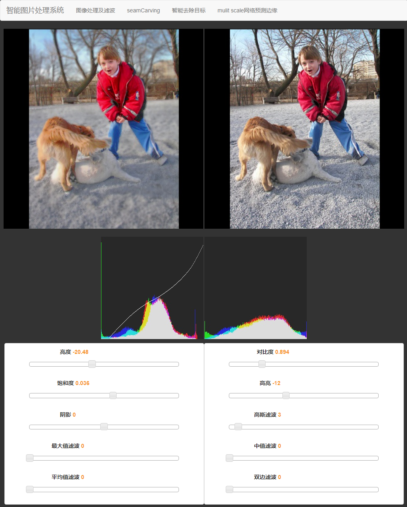
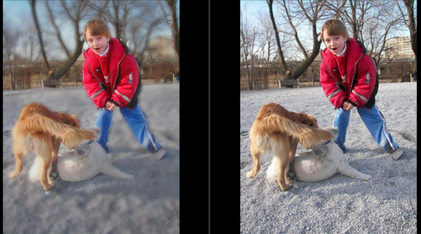
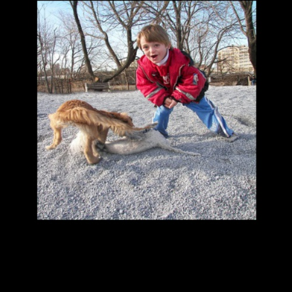
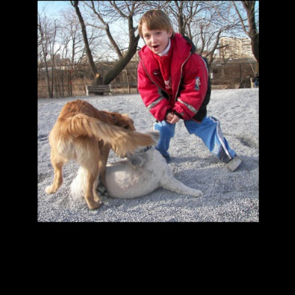
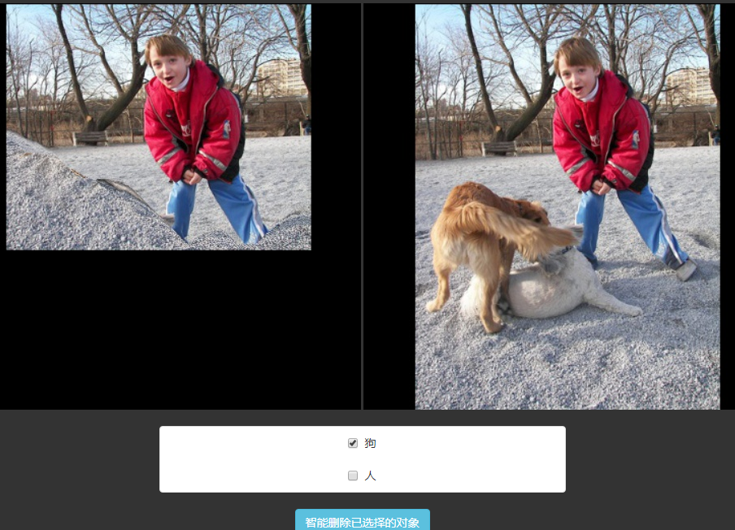

# 智能图片处理系统

> Author：`Lei Yang`

> E-mail：`ylxx@live.com`

> Data：`2017-04-30`

> Description：手工实现的智能图片处理系统 包含基础的图片处理功能 各类滤波 seam carving算法 以及结合精细语义分割信息 实现智能去除目标的功能

## 功能一览
 界面

* 手工实现高斯 中值 双边等图像滤波(滤镜)算法

* 内置自己之前写的显著性算法，与图像处理模块结合 实现前景 背景自动分离 分开处理

* 实现了图像压缩算法 [seam carving](https://en.wikipedia.org/wiki/Seam_carving)

(压缩50排像素)

* 将显著性算法与seam carving结合 达到更优的压缩效果

### 智能去除目标
* 结合一个基于caffe的精细语义分割方法 [`SEC`](https://github.com/kolesman/SEC) 能将语义信息与seam carving 结合 实现智能去除目标

## 注意事项

### 效率
由于这是应 北京化工大学 胡伟老师的《数字媒体技术课》而做的课程设计

所以 除了`SEC语义分割` 其余均是我使用Python手工完成

故而效率不佳 建议测试图片分辨率在500*500左右 从而得到可接受的计算时间

### 显著性计算

第一次载入图片 显著性计算需要 40s 左右的时间，计算结果会保存为`[path]/[name]_sal.png` ,下次不需要计算

### SEC语义分割

若要使用智能去除目标功能

请在Linux下 配置 [`SEC`](https://github.com/kolesman/SEC)

将计算结果保存为`[path]/[name]_SS.png` 程序会自动读取使用语义信息

## 配置

环境： `Python2.7 64bit`

安装库： `pip install -r requirements.txt`
(若pip编译失败 请使用conda装)

运行： `python imgProcessBackEnd.py`

在`imgProcessConfig.py`中 更改path变量更改处理的图片

【EOF】
